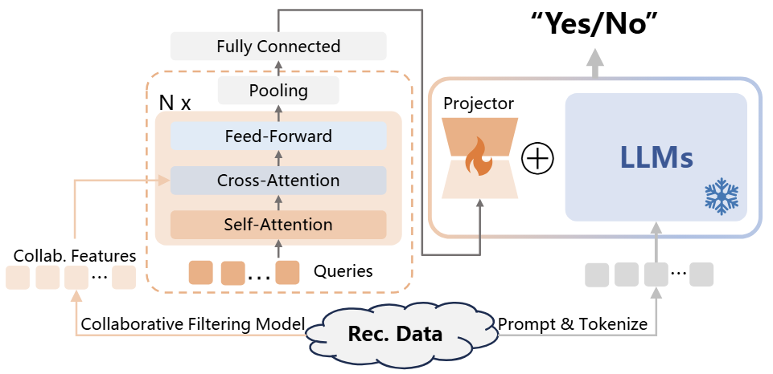

# CoRA: Collaborative Information Perception by Large Language Model's Weights for Recommendation

[Yuting Liu](https://vanillacreamer.github.io/), Jinghao Zhang, Yizhou Dang, Yuliang Liang, Qiang Liu, Guibing Guo, Jianzhe Zhao and Xingwei Wang. 

This repository contains the replication of the AAAI 2025 paper [CoRA: Collaborative Information Perception by Large Language Model's Weights for Recommendation](https://arxiv.org/abs/2408.10645).


## Overview

In this paper, we explore the issues present when integrating textual prompts and collaborative features in LLM's input space. 
To resolve these matters, we propose to equip LLMs with collaborative perception capability by merging collaborative weights into LLM's pre-trained weights. 
It can be seen as Collaborative LoRA (**CoRA**), facilitating the cooperation of text and collaborative information.





## Getting Started
### Installation

**1. Prepare the code and the environment**

Creating a python environment and activate it:

```bash
conda env create -f environment.yml
conda activate minigpt4
```

**2. Prepare the pretrained Vicuna weights**

Please refer to Mini-GPT4's instruction [here](PrepareVicuna.md) to prepare the Vicuna weights.

Then, set the path to the Vicuna weight in the `"llama_model" ` field of a training config file, e.g., [here](train_configs/plora_pretrain_lgcn_movie.yaml#L15).

**3. Prepare the Datasets**

You can process the data yourself using the code provided in the ```./dataset``` directory. Alternatively, you can download the pre-processed data from [here](collm-datasets/).


### Training

**1. Collaborative Pre-training**

Before equipping LLMs with collaborative information, you should pre-train a collaborative filtering model
with the following scripts:

```shell
python baseline_train_mf_ood.py
...
```

**2. CoRA Tuning**

To fine-tuning LLM with pre-trained collaborative filtering models, you need to set the hyper-parameters in the training config file
(e.g., [train_configs/plora_pretrain_mf_ood_movie.yaml](train_configs/plora_pretrain_mf_ood_movie.yaml)) as follows:

```
- freeze_rec: True
- freeze_lora: False
- prompt_path: "prompts/tallrec_movie.txt" # use the prompt with the user/item IDs
- pretrained_path: pretrained_collab_model_path # pretrained collab. model path 
- ckpt: None 
- evaluate：False #set training
```

The run the following command:
```shell
python train_collm_mf_din.py --cfg-path=train_configs/plora_pretrain_mf_ood_movie.yaml
```

### Evaluation
Set the hyper-parameters in the training config file as follows:
```
- ckpt: your_checkpoint_path # trained model path
- evaluate: True # only evaluate
```
Then run the same command to the first stage training.


If you're using CoRA code in your research or applications, please cite our paper using this BibTeX:
```bibtex
@article{liu2024cora,
      title={CoRA: Collaborative Information Perception by Large Language Model's Weights for Recommendation}, 
      author={Yuting Liu and Jinghao Zhang and Yizhou Dang and Yuliang Liang and Qiang Liu and Guibing Guo and Jianzhe Zhao and Xingwei Wang},
      year={2024},
      journal={arXiv preprint arXiv:2408.10645}
}
```


## Acknowledgement

+ [MiniGPT4](https://github.com/Vision-CAIR/MiniGPT-4) and [CoLLM](https://github.com/zyang1580/CoLLM). Our repository is built upon MiniGPT-4 and CoLLM. We thank the authors for their wonderful work.
+ [Vicuna](https://github.com/lm-sys/FastChat). The fantastic language ability of Vicuna with only 13B parameters is just amazing. And it is open-source!

